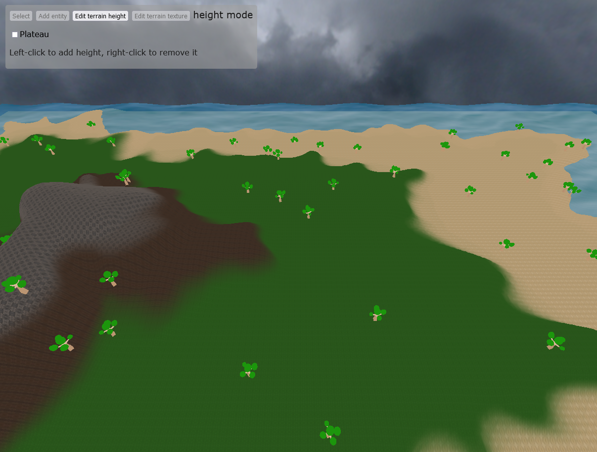

# WaaS (World as a Service)

3D terrain sandbox, playground for my gamedev experiments.



## Local dev environment

```
# If assets have changed / new ones have been added
node build-asset-list.js
npm run dev
```

Note: If Firefox has "resistFingerprinting" enabled, rendering is broken :(

## Building for production

```
npm run build
```

### Features

- Camera movement with WASD, turning with Q and E, reset rotation with SPACE
- Animated water
- Skybox
- Doodad objects on the map (tree)
- Textured terrain
- Height editing
  - add/remove terrain
  - create plateau
  - smoothen heights
- Texture painting (with texture weight maps, supports arbitrary number of terrain types)

### Next TODOs

- Add heightmap normals to enable lighting
  - we will have to re-use a lot of three.js vertex shader chunks, like here: https://github.com/mrdoob/three.js/blob/master/examples/webgl_gpgpu_water.html#L174
  - then we can use the phong lighting chunk for the actual lighting in the fragment shader
  - we will need to include the uniforms of the Phong material, too: https://github.com/mrdoob/three.js/blob/master/examples/webgl_gpgpu_water.html#L402
  - OR we could use a MeshPhongMaterial and extend it with onBeforeCompile: https://github.com/mrdoob/three.js/blob/master/examples/webgl_materials_modified.html
- Implement camera zoom
- Placing of doodads/entities & selection
- Make terrain types configurable (currently names are hardcoded in HTML + terrain.ts)
- Downloading/saving of maps (heightmap + weight map + placed entities)
- Uploading/loading of maps
- Make water transparency dependent on terrain height (i.e. deeper water is less transparent)